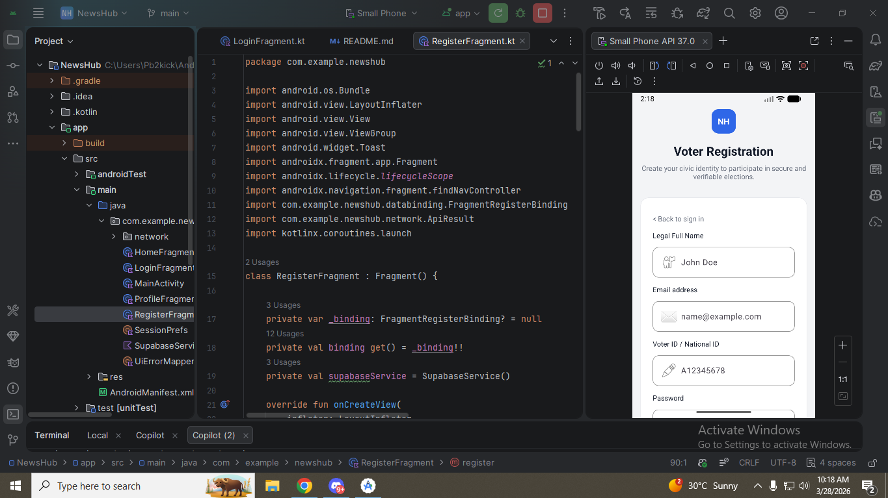
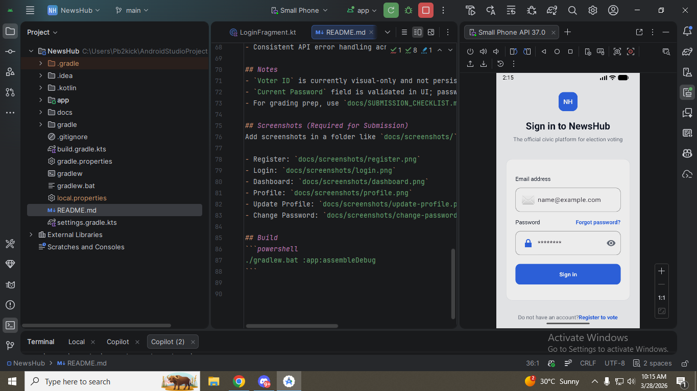
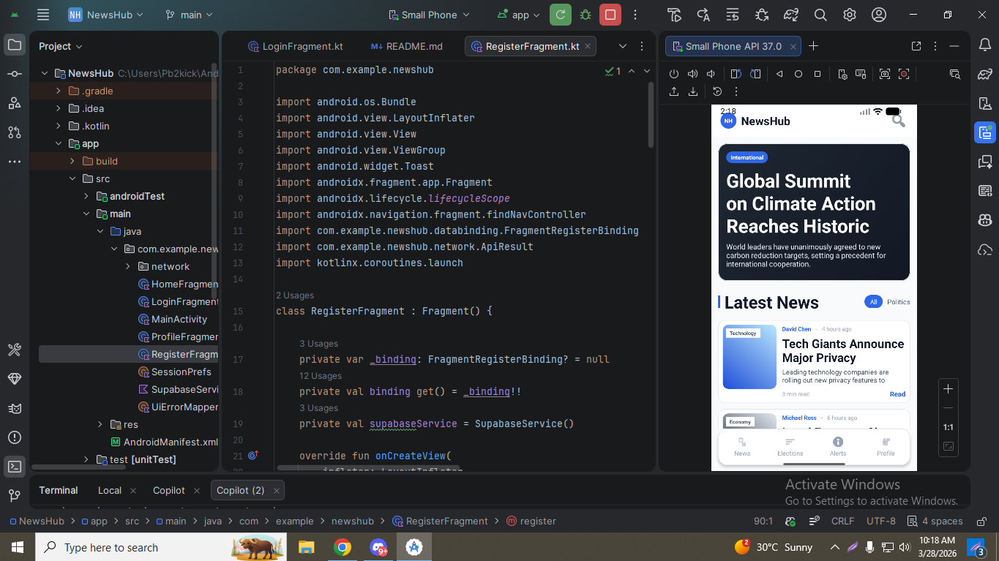
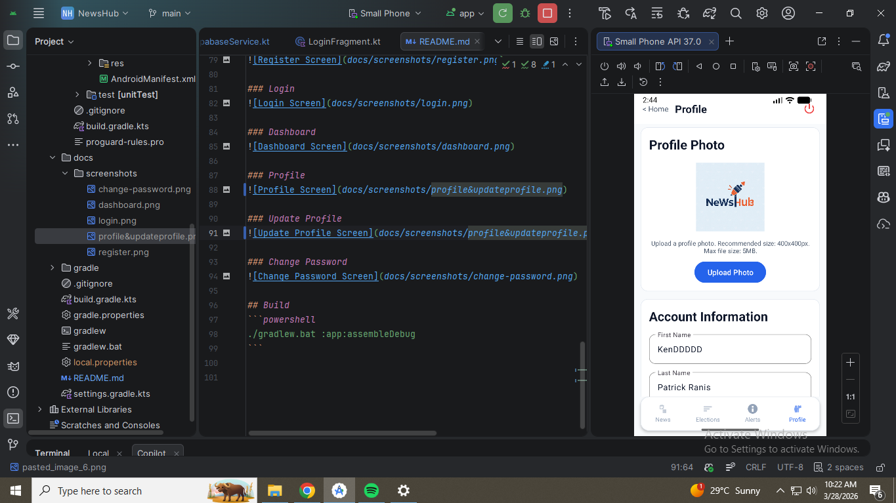
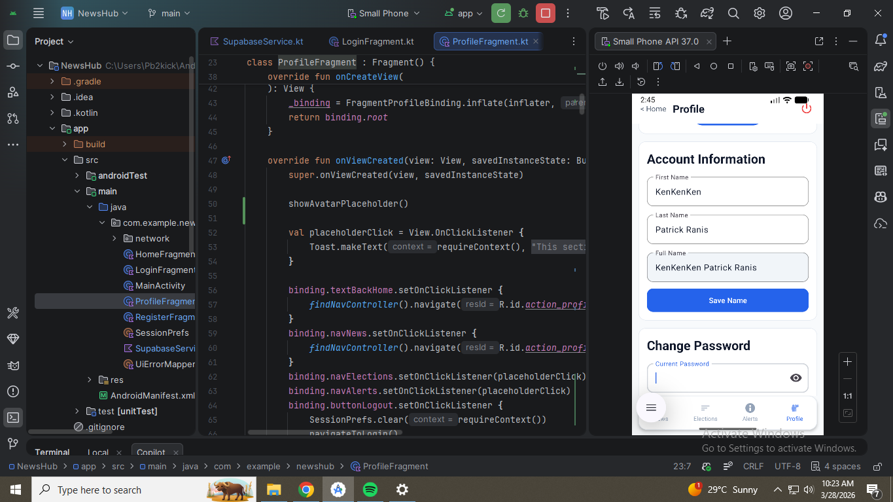
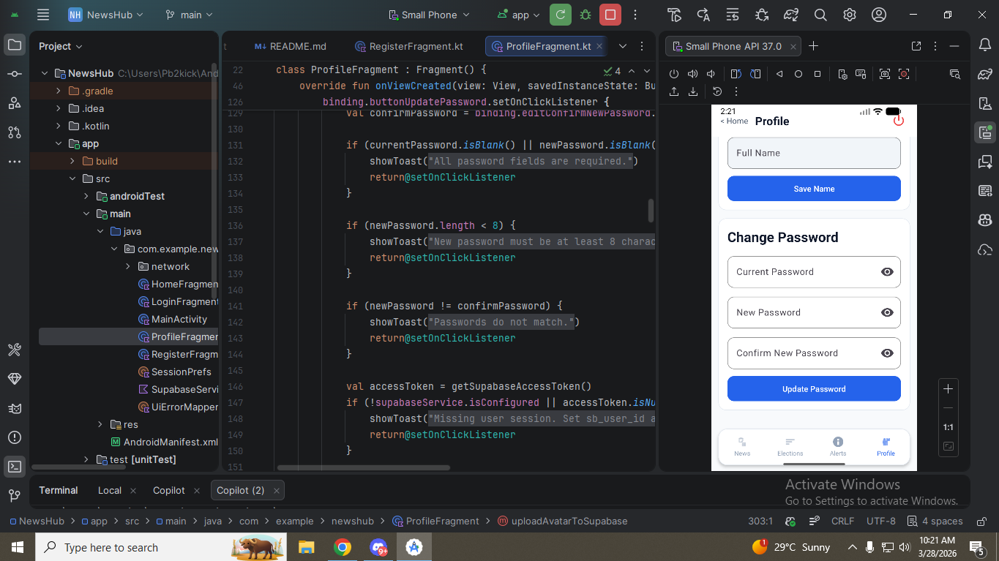

# NewsHub Android - API Integration

This project implements the required backend API integration for:
- Register
- Login
- Dashboard (`HomeFragment`)
- Profile
- Update Profile (name + profile picture)
- Change Password

## Tech Stack
- Kotlin + XML
- Retrofit `2.9.0`
- Gson Converter `2.9.0`
- OkHttp `4.12.0`
- Coroutines

## Supabase Configuration
Add these values in `gradle.properties`:

```properties
SUPABASE_URL=YOUR_SUPABASE_URL
SUPABASE_ANON_KEY=YOUR_SUPABASE_ANON_KEY
SUPABASE_PROFILE_BUCKET=profile-pictures
SUPABASE_PROFILE_TABLE=users
SUPABASE_PROFILE_USER_ID_COLUMN=auth_user_id
SUPABASE_PROFILE_PHOTO_COLUMN=profile_photo_url
```

## API Layer Structure
- `app/src/main/java/com/example/newshub/network/ApiClient.kt` - centralized Retrofit client
- `app/src/main/java/com/example/newshub/network/SupabaseAuthApi.kt` - auth endpoints
- `app/src/main/java/com/example/newshub/network/SupabaseRestApi.kt` - profile table endpoints
- `app/src/main/java/com/example/newshub/network/SupabaseStorageApi.kt` - avatar upload endpoint
- `app/src/main/java/com/example/newshub/network/model/AuthModels.kt` - request/response DTOs
- `app/src/main/java/com/example/newshub/network/model/ProfileModels.kt` - profile request/response DTOs
- `app/src/main/java/com/example/newshub/UiErrorMapper.kt` - maps API failures to user-facing messages
- `app/src/main/java/com/example/newshub/network/ApiResult.kt` - unified success/failure result type
- `app/src/main/java/com/example/newshub/network/ErrorMapper.kt` - maps HTTP/network errors
- `app/src/main/java/com/example/newshub/SupabaseService.kt` - centralized service consumed by UI

## Rubric Mapping
- Register -> `RegisterFragment` + `SupabaseService.signUpWithPassword`
- Login -> `LoginFragment` + `SupabaseService.signInWithPassword`
- Dashboard -> `HomeFragment` (validates session token via `/auth/v1/user`)
- Profile -> `ProfileFragment` + `SupabaseService.fetchProfile`
- Update Profile -> `ProfileFragment.buttonSaveName` + `SupabaseService.upsertProfile`
- Change Password -> `ProfileFragment.buttonUpdatePassword` + `SupabaseService.updatePassword`

## Auth + Bearer Token
- Access token and user id are stored in `SessionPrefs` after login.
- Protected calls include:
  - `Authorization: Bearer <token>`
  - `apikey: <anon_key>`

## HTTP Status Handling
Implemented through `ApiResult.Failure` + `ErrorMapper`:
- `200`/success -> `ApiResult.Success`
- `400` -> bad request user message
- `401` -> unauthorized, session cleared, user redirected to login
- `500+` -> server error user message
- Network/IO failure -> no internet/network message

## UI/UX Requirements Covered
- Loading indicators on Login/Register/Home/Profile pages
- Buttons disabled during API calls
- User-friendly success/error toasts
- Consistent API error handling across screens

## Notes
- `Voter ID` is currently visual-only and not persisted to backend.
- `Current Password` field is validated in UI; password update is handled by Supabase Auth token endpoint.
- For grading prep, use `docs/SUBMISSION_CHECKLIST.md`.

## Screenshots (Required for Submission)
Store screenshots in `docs/screenshots/` using the filenames below.

### Register


### Login


### Dashboard


### Profile


### Update Profile


### Change Password


## Build
```powershell
./gradlew.bat :app:assembleDebug
```

